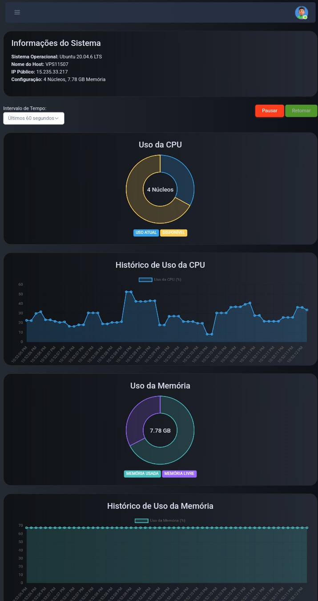

# # Painel WebHostPro

- **Demo**
  https://demo.webhostpro.com.br
  login: admin@webhostpro.com.br
  senha: @Webhost2024

### Tela Inicial

### Tela de cadastro

### Tela de recuperar senha

### deshboard

Painel WebHostPro é uma aplicação web desenvolvida em Node.js com EJS e gerenciada com PM2. Ele facilita o gerenciamento de hospedagem de sites em PHP, criando ambientes isolados para cada usuário e automatizando a configuração de serviços como Nginx, Certbot, PHPMyAdmin e outros.

## Funcionalidades

- **Hospedagem de PHP** (v7.4, v8.0, v8.1, v8.2, v8.3) com pools PHP separados para cada usuário.
- **Proxy Reverso** configurado automaticamente usando Nginx.
- **Integração com PHPMyAdmin** para gerenciamento de bancos de dados.
- **SSL com Certbot**: Certificados SSL automáticos para os domínios dos usuários.
- **Gerenciamento de Arquivos** integrado.
- **Sistema de Pagamentos** via Mercado Pago e Stripe.
- **Integração com DNS**: Configuração automática de Name Servers via Cloudflare.
- **Logs** de acesso e erro disponíveis para cada domínio.
- **Sistema de Cron Jobs** para tarefas agendadas.
- **Backup de Banco de Dados** automatizado com integração ao Telegram.
- **Recuperação de Senha por E-mail**.
- **Criação de Planos** para usuários, com configuração automática de diretórios e arquivos de serviço.
- **Administração Completa**: Painel de administração para gerenciar usuários, planos e serviços.
- **Área do Usuário**: Interface dedicada para o usuário gerenciar seus domínios e configurações.
- **Google reCAPTCHA via Cloudflare**: Proteção contra bots.
- **Automação de Configurações**: O sistema gera automaticamente os arquivos de configuração do Nginx para domínios e subdomínios.

## Gerenciamento de Banco de Dados com PHPMyAdmin

Os usuários têm acesso ao **PHPMyAdmin** para gerenciar seus bancos de dados MySQL diretamente pelo painel. O sistema permite a criação e administração de bases de dados de forma segura e eficiente. Para cada usuário, o sistema cria um ambiente isolado, garantindo que os dados de diferentes clientes sejam mantidos em segurança.

## Tecnologias Utilizadas

- **Node.js**
- **EJS** (como template engine)
- **PM2** (para gerenciamento de processos)
- **Nginx** (proxy reverso e servidor web)
- **PHPMyAdmin**
- **Certbot** (para certificados SSL)
- **Mercado Pago e Stripe** (sistema de pagamento)
- **Cloudflare** (DNS e reCAPTCHA)
- **Telegram API** (para alertas de backup)
- **MySQL** (banco de dados)
- **PHP** (v7.4, v8.0, v8.1, v8.2, v8.3)

## Pré-requisitos

- **Node.js** (v20+)
- **Nginx**
- **PHP** (7.4, 8.0, 8.1, 8.2, 8.3)
- **MySQL/MariaDB**
- **Certbot** (para SSL)
- **PM2** (para gerenciar processos Node.js)

## Configurações Automáticas

O sistema realiza as seguintes configurações automaticamente:

- Criação de arquivos e diretórios para novos domínios e usuários.
- Geração dos arquivos de configuração do Nginx.
- Configuração do Certbot para emissão de certificados SSL.
- Configuração do PHP (v7.4, v8.0, v8.1, v8.2, v8.3) com pools individuais (`pool.d`) para cada usuário.
- Integração com Cloudflare para gerenciamento de DNS e proteção reCAPTCHA.
- Backup diário do banco de dados com notificação via Telegram.

## Funcionalidades do Painel

- **Administração**: Interface para criar, editar e remover usuários, domínios e planos.
- **Área do Usuário**: Cada usuário pode gerenciar seus domínios, acessar seus arquivos, configurar cron jobs, visualizar logs, e restaurar backups.
- **Recuperação de Senha**: Sistema de recuperação de senha por e-mail.
- **Pagamento e Assinatura**: Os usuários podem gerenciar suas assinaturas através dos sistemas de pagamento Mercado Pago e Stripe.

## Backup

Os backups automáticos do banco de dados são realizados diariamente e os arquivos são enviados para um canal no Telegram para maior segurança. O processo de restauração pode ser feito diretamente pela interface de administração.

## Cron Jobs

Usuários podem configurar tarefas agendadas (cron jobs) diretamente pelo painel. Essas tarefas são gerenciadas automaticamente pelo sistema.

## Licença

Este projeto é licenciado sob uma **Licença Proprietária Privada**. Todos os direitos estão reservados a **Jefferson Hipólito de Oliveira**. Nenhuma parte deste projeto pode ser utilizada, copiada, modificada ou distribuída sem permissão explícita por escrito.

Para mais detalhes, consulte o arquivo [LICENSE](./LICENSE.md).
